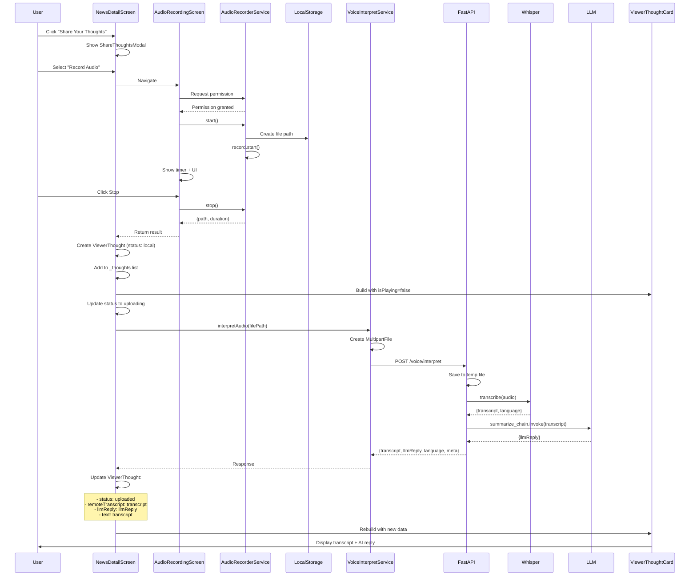
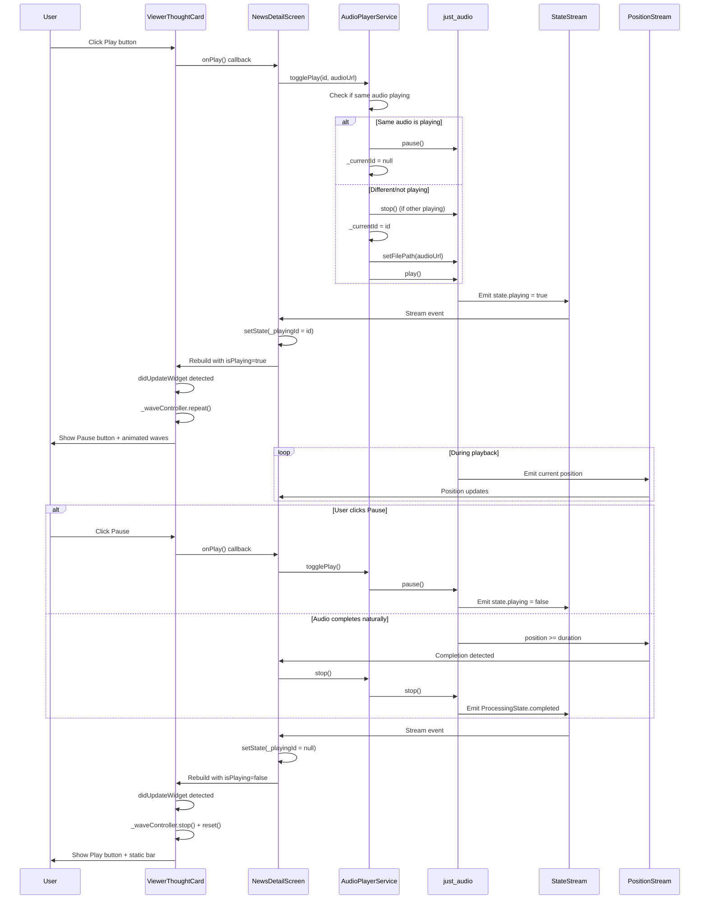

# Audio Recording & Playback System - Complete Architecture

## Table of Contents
1. [Overview](#overview)
2. [System Architecture](#system-architecture)
3. [Complete Flow: Recording to Playback](#complete-flow)
4. [Sequence Diagrams](#sequence-diagrams)
5. [Component Details](#component-details)
6. [Data Models](#data-models)
7. [State Management](#state-management)

---

## Overview

This system enables users to:
1. **Record audio** thoughts on news articles
2. **Store audio** locally on device
3. **Transcribe audio** using Whisper STT (backend)
4. **Generate AI summary** using LLM (Gemini 1.5 Flash)
5. **Display transcript & AI reply** in the UI
6. **Playback recorded audio** with animated visualization

---

## System Architecture

```
┌─────────────────────────────────────────────────────────────────┐
│                        Flutter Application                      │
├─────────────────────────────────────────────────────────────────┤
│                                                                 │
│  ┌──────────────────┐    ┌──────────────────┐                │
│  │  NewsDetailScreen │    │ ViewerThoughtCard │                │
│  │  (Main UI)        │───▶│  (Audio Player)   │                │
│  └──────────────────┘    └──────────────────┘                │
│         │                            │                          │
│         │                            │                          │
│         ▼                            ▼                          │
│  ┌──────────────────┐    ┌──────────────────┐                │
│  │ AudioRecording   │    │ AudioPlayer       │                │
│  │ Screen           │    │ Service           │                │
│  └──────────────────┘    └──────────────────┘                │
│         │                            │                          │
│         │                            │                          │
│         ▼                            ▼                          │
│  ┌──────────────────┐    ┌──────────────────┐                │
│  │ AudioRecorder    │    │ just_audio       │                │
│  │ Service          │    │ (Playback)      │                │
│  └──────────────────┘    └──────────────────┘                │
│         │                                                       │
│         │ (Save to device)                                     │
│         ▼                                                       │
│  ┌──────────────────┐                                          │
│  │ Local File       │                                          │
│  │ Storage          │                                          │
│  └──────────────────┘                                          │
│         │                                                       │
│         │ (Upload via HTTP)                                     │
│         ▼                                                       │
└─────────┼───────────────────────────────────────────────────────┘
          │
          │ HTTP POST multipart/form-data
          │
          ▼
┌─────────────────────────────────────────────────────────────────┐
│                    FastAPI Backend Server                       │
├─────────────────────────────────────────────────────────────────┤
│                                                                 │
│  ┌──────────────────┐                                          │
│  │ /voice/interpret │                                          │
│  │ (Endpoint)       │                                          │
│  └──────────────────┘                                          │
│         │                                                       │
│         ├─────────────────┬──────────────────┐                 │
│         │                 │                  │                 │
│         ▼                 ▼                  ▼                 │
│  ┌──────────────┐  ┌──────────────┐  ┌──────────────┐        │
│  │ Whisper STT  │  │ LangChain    │  │ Response     │        │
│  │ (Transcribe) │─▶│ LLM (Gemini) │─▶│ Formatter    │        │
│  └──────────────┘  └──────────────┘  └──────────────┘        │
│                                                                 │
└─────────────────────────────────────────────────────────────────┘
```

---

## Complete Flow: Recording to Playback

### Phase 1: Audio Recording Flow

```
User clicks "Share Your Thoughts"
    │
    ▼
Show ShareThoughtsModal
    │
    ▼
User selects "Record Audio"
    │
    ▼
Navigate to AudioRecordingScreen
    │
    ▼
Request Microphone Permission
    │
    ▼
[Permission granted?]
    │
    ├─ NO ──▶ Show Error → Return
    │
    └─ YES ──▶
           │
           ▼
    Initialize AudioRecorderService
           │
           ▼
    Generate file path:
    /documents/audio_{timestamp}.m4a
           │
           ▼
    Start recording (record plugin)
           │
           ▼
    Show timer + recording UI
           │
           ▼
    [User clicks Stop]
           │
           ▼
    Stop recording
           │
           ▼
    Return: {path, duration, transcript}
           │
           ▼
    Back to NewsDetailScreen
```

### Phase 2: Backend Processing Flow

```
NewsDetailScreen receives audio result
    │
    ▼
Create ViewerThought object:
  - id: timestamp
  - type: audio
  - localFilePath: /path/to/file.m4a
  - status: ThoughtStatus.local
  - text: localTranscript (if available)
    │
    ▼
Add to _thoughts list (UI updates)
    │
    ▼
Call VoiceInterpretService.interpretAudio()
    │
    ▼
Update status to ThoughtStatus.uploading
    │
    ▼
Create MultipartFile from audio file
    │
    ▼
POST to http://192.168.29.100:8000/voice/interpret
    │
    ├─ FormData:
    │   - file: audio.m4a
    │   - language: 'en' or 'hi'
    │
    ▼
[Network Request]
    │
    ├─ ERROR ──▶ Update status to ThoughtStatus.failed
    │             Show error message
    │
    └─ SUCCESS ──▶
              │
              ▼
    Backend Processing:
    1. Save audio to temp file
    2. Whisper STT transcribes audio
    3. LangChain processes transcript with LLM
    4. Return: {transcript, llmReply, language, meta}
              │
              ▼
    Update ViewerThought:
      - status: ThoughtStatus.uploaded
      - remoteTranscript: response.transcript
      - llmReply: response.llmReply
      - text: response.transcript (replace local)
              │
              ▼
    UI updates automatically
```

### Phase 3: Audio Playback Flow

```
User clicks Play button on ViewerThoughtCard
    │
    ▼
onPlay callback triggered
    │
    ▼
Check if audioUrl exists
    │
    ├─ NO ──▶ Return (no audio to play)
    │
    └─ YES ──▶
           │
           ▼
    AudioPlayerService.togglePlay()
           │
           ├─ If same audio is playing:
           │     Pause → Clear _currentId → Return
           │
           └─ If different/not playing:
                 │
                 ▼
          Stop any currently playing audio
                 │
                 ▼
          Set _currentId = thought.id
                 │
                 ▼
          Load file: _player.setFilePath(audioUrl)
                 │
                 ▼
          Start playback: _player.play()
                 │
                 ▼
    [Stream Listeners React]
                 │
                 ├─ playerStateStream:
                 │     - state.playing = true
                 │     - Update _playingId = thought.id
                 │     - UI shows Pause button
                 │
                 └─ positionStream:
                       - Updates as audio plays
                       - Detects when position >= duration
                       - Clears _playingId when finished
                 │
                 ▼
    ViewerThoughtCard receives isPlaying = true
                 │
                 ▼
    didUpdateWidget detects change
                 │
                 ▼
    Start wave animation: _waveController.repeat()
                 │
                 ▼
    UI shows:
      - Pause button (instead of Play)
      - Animated sound waves
```

### Phase 4: Playback Completion Flow

```
Audio reaches end OR user clicks Pause
    │
    ▼
[Position Stream OR State Stream]
    │
    ├─ User clicks Pause:
    │     │
    │     ▼
    │   _player.pause()
    │     │
    │     ▼
    │   playerStateStream emits: state.playing = false
    │     │
    │     ▼
    │   Stream listener sets: _playingId = null
    │
    └─ Audio completes naturally:
          │
          ▼
      positionStream detects: position >= duration
          │
          ▼
      OR playerStateStream emits: ProcessingState.completed
          │
          ▼
      Stream listener sets: _playingId = null
          │
          ▼
      Call _player.stop()
          │
          ▼
    ViewerThoughtCard receives isPlaying = false
          │
          ▼
    didUpdateWidget detects change
          │
          ▼
    Stop animation: _waveController.stop() + reset()
          │
          ▼
    UI shows:
      - Play button (instead of Pause)
      - Static gray bar (no waves)
```

---

## Sequence Diagrams

### Complete Audio Recording → Processing → Display Flow



### Audio Playback Flow



---

## Component Details

### 1. AudioRecorderService (`lib/services/audio_recorder.dart`)

**Purpose**: Wraps the `record` plugin to handle audio recording.

**Key Methods**:
- `start()`: Request permission → Generate file path → Start recording
- `stop()`: Stop recording → Return file path
- `cancel()`: Stop recording → Delete temporary file

**File Storage**:
- Location: App documents directory (`getApplicationDocumentsDirectory()`)
- Format: `.m4a` (AAC encoding)
- Naming: `audio_{timestamp}.m4a`

### 2. AudioPlayerService (`lib/services/audio_player_service.dart`)

**Purpose**: Singleton service managing audio playback using `just_audio`.

**Key Properties**:
- `_currentId`: Tracks which thought is currently playing
- `playerStateStream`: Stream of player state changes
- `positionStream`: Stream of playback position
- `duration`: Current audio duration

**Key Methods**:
- `togglePlay(id, sourcePath)`: Play/pause toggle logic
- `stop()`: Stop playback and clear current ID

### 3. VoiceInterpretService (`lib/services/voice_interpret_service.dart`)

**Purpose**: Handles communication with FastAPI backend for STT + LLM.

**Key Methods**:
- `interpretAudio(filePath)`: 
  1. Read audio file
  2. Create `MultipartFile`
  3. POST to `/voice/interpret`
  4. Return response with transcript + LLM reply

**Request Format**:
```dart
FormData({
  'file': MultipartFile.fromFile(path),
  'language': 'en' or 'hi'
})
```

### 4. NewsDetailScreen (`lib/features/headlines/presentation/news_detail_screen.dart`)

**Purpose**: Main screen displaying article and thoughts.

**State Management**:
- `_thoughts`: List of `ViewerThought` objects
- `_playingId`: ID of currently playing audio
- `_player`: AudioPlayerService instance
- Stream subscriptions: `_playerStateSubscription`, `_positionSubscription`

**Key Flows**:
1. **Recording**: Receive result → Create thought → Upload to backend
2. **Playback**: Handle play/pause → Update `_playingId` → Rebuild UI

### 5. ViewerThoughtCard (`lib/widgets/viewer_thought_card.dart`)

**Purpose**: Displays individual thought with audio player UI.

**Key Features**:
- Animated sound waves (when playing)
- Transcript toggle (View/Hide)
- AI reply display (as caption above player)
- Play/Pause button

**Animation**:
- `_waveController`: AnimationController for wave animation
- 20 animated bars with sine wave pattern
- Starts when `isPlaying` becomes true
- Stops and resets when `isPlaying` becomes false

### 6. AudioRecordingScreen (`lib/widgets/audio_recording_screen.dart`)

**Purpose**: UI for recording audio.

**Features**:
- Timer display
- Record/Stop/Cancel buttons
- Visual feedback during recording

---

## Data Models

### ViewerThought (`lib/features/headlines/data/viewer_thought_model.dart`)

```dart
class ViewerThought {
  final String id;                    // Unique identifier
  final String userName;             // "You" or username
  final ThoughtType type;             // audio, video, text
  final String? text;                 // Transcript (local or remote)
  final String? audioUrl;             // Remote URL or local file path
  final String? localFilePath;       // Local device path
  final String? remoteFileId;         // Backend GridFS ID (for MongoDB)
  final Duration? duration;           // Audio length
  final ThoughtStatus status;         // local, uploading, uploaded, failed
  final String? llmReply;             // AI-generated summary/caption
  final String? headlineId;           // Link to parent article
  final DateTime createdAt;          // Timestamp
}
```

**ThoughtStatus Enum**:
- `local`: Recorded locally, not uploaded
- `uploading`: Currently uploading
- `uploaded`: Uploaded and processed
- `failed`: Upload/processing failed

---

## State Management

### Playback State Flow

```
_playingId (in NewsDetailScreen)
    │
    ├─ null → No audio playing
    │         → ViewerThoughtCard.isPlaying = false
    │         → Play button shown
    │         → No waves animation
    │
    └─ thought.id → Audio is playing
                    → ViewerThoughtCard.isPlaying = true
                    → Pause button shown
                    → Waves animation active
```

### State Updates Triggers

1. **User clicks Play/Pause**:
   - `onPlay()` → `AudioPlayerService.togglePlay()`
   - Immediate `setState(_playingId = currentId)`
   - Stream listener updates if needed

2. **Player state changes** (via stream):
   - `state.playing = true` → Set `_playingId`
   - `state.playing = false` → Clear `_playingId`
   - `ProcessingState.completed` → Clear `_playingId`

3. **Position reaches end** (via position stream):
   - `position >= duration` → Clear `_playingId` → Call `stop()`

---

## Backend Architecture

### FastAPI Endpoints

#### POST `/voice/interpret`

**Request**:
- `file`: Multipart audio file (.m4a)
- `language`: Optional language hint ('en' or 'hi')

**Processing Pipeline**:
1. Save uploaded file to temporary location
2. Load Whisper model (faster-whisper or openai-whisper)
3. Transcribe audio → `transcript`
4. Send transcript to LangChain LLM chain
5. Generate summary → `llmReply`
6. Return response

**Response**:
```json
{
  "transcript": "User's spoken text...",
  "language": "en",
  "llmReply": "AI-generated summary...",
  "meta": {
    "sttBackend": "faster-whisper",
    "duration": 12.5
  }
}
```

### LLM Chain (LangChain)

**Prompt Template**:
```
You are a community assistant for a senior citizen app.
Read the following transcript.
Your task is to write a single, 1-sentence "headline" 
for this post (max 15 words).

Transcript: "{transcript}"

Return *only* the summary headline and nothing else.
```

**Model**: Gemini 1.5 Flash (via LangChain)
**Temperature**: 0.3 (for consistency)

---

## Key Design Decisions

1. **Local Storage First**: Audio saved locally before upload (offline support)
2. **Singleton Services**: AudioPlayerService is singleton (one player at a time)
3. **Stream-Based State**: Real-time UI updates via streams
4. **Dual Stream Listeners**: State stream + position stream for reliability
5. **Status Tracking**: ThoughtStatus enum tracks upload/processing state
6. **Immediate UI Feedback**: Local transcript shown while uploading
7. **Animation Syncing**: Wave animation tied to actual playback state

---

## Error Handling

### Recording Errors
- Permission denied → Show error, return early
- File creation failed → Exception caught, user notified

### Network Errors
- Upload timeout → Status set to `failed`, error shown
- Backend error → Status set to `failed`, error message displayed

### Playback Errors
- File not found → No action (button disabled)
- Playback error → Stream listener handles, state cleared

---

## Future Enhancements (MongoDB Integration)

### Data Storage Schema

```javascript
{
  _id: ObjectId,
  headlineId: String,      // Reference to article
  userId: String,           // User who created
  type: "audio",
  remoteFileId: String,     // GridFS file ID
  transcript: String,      // Whisper transcript
  llmReply: String,        // AI summary
  duration: Number,         // Duration in seconds
  status: String,           // uploaded, approved, flagged
  createdAt: ISODate,
  updatedAt: ISODate
}
```

### API Endpoints (Future)
- `POST /api/thoughts` - Create thought
- `GET /api/thoughts/:headlineId` - Get thoughts for article
- `PUT /api/thoughts/:id` - Update thought
- `DELETE /api/thoughts/:id` - Delete thought

---

## Summary

This system provides a complete audio recording → transcription → AI processing → playback pipeline:

1. **Record** audio using device microphone
2. **Store** locally for immediate playback
3. **Upload** to backend for processing
4. **Transcribe** using Whisper STT
5. **Summarize** using LLM (Gemini)
6. **Display** transcript and AI reply
7. **Playback** with visual feedback

The architecture is designed for:
- ✅ Offline-first recording
- ✅ Real-time UI updates
- ✅ Reliable state management
- ✅ Scalable backend processing
- ✅ Future MongoDB integration

