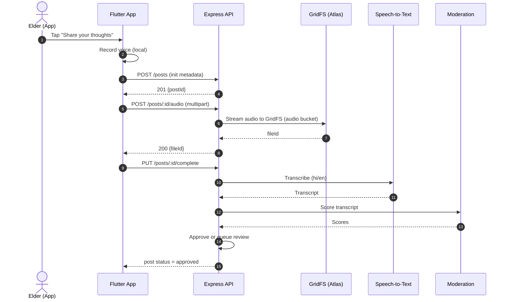
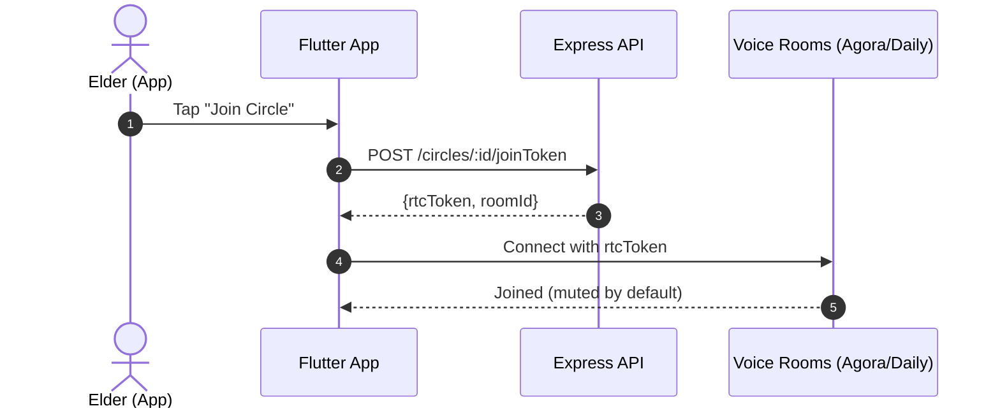

## Chaupal Voice – Implementation Plan (S3-free, MongoDB Atlas + GridFS)

### Scope (focused MVP)
- Curated headlines (3–5), large text + Listen (TTS)
- Share thoughts via voice (auto-transcribed); optional short text
- Community wall with Sammaan (Respect), Gyaan (Insightful), comments
- Small voice circles (4–6 people) per active topic
- Toll‑free IVR: hear headlines, record opinion, hear replies
- Safety: OTP auth, reporting, civility prompts, human moderation

### Accessibility specification
- Visual
  - Font sizes: base 18–20sp; headings 24–28sp; buttons 20–22sp; line height ≥ 1.4
  - Tap targets: ≥ 56×56 dp; spacing ≥ 8–12dp between controls
  - Icon sizes: 32–48dp; labels accompany icons; avoid icon-only CTAs
  - Contrast: target WCAG AAA; minimum 7:1; do not rely on color-only states
  - Focus/selection: visible focus ring; clear selected states
  - Motion: honor reduce motion; avoid looping animations
- Language & content
  - Languages at launch: Hindi and English; persistent language toggle on Home
  - TTS: on-device preferred (Flutter TTS) with server fallback; adjustable speed (0.85–1.0x default)
  - STT: Hindi/English models; transcript confirmation before posting
  - Copy: short, plain sentences; consistent terms (Sammaan, Gyaan)
- Interactions
  - Primary actions: bottom-fixed, full-width; destructive actions confirmed
  - Voice-first: “Record” primary everywhere; “Type” secondary
  - Haptics + audio feedback on tap (respect system settings)
- Error prevention & recovery
  - Permission pre-checks, recorder test, network preflight
  - Auto-save drafts; resume failed uploads; explicit retry UI
- IVR parity
  - IVR supports: 1=Listen, 2=Record, 3=Hear replies; slow prompts; repeat (9)

### Tech stack
- Mobile App (Flutter)
  - Routing: go_router
  - State: Riverpod or Bloc
  - Networking: dio
  - Audio record/play: record, just_audio
  - TTS: flutter_tts (on-device); server fallback when needed
  - STT: speech_to_text (device) + server fallback (Google Speech-to-Text)
  - Notifications: Firebase Cloud Messaging (FCM)
  - Auth: Phone OTP (Firebase Auth) or SMS vendor (MSG91/Twilio) + backend JWT
  - Localization: intl + ARB; dynamic text scale and high-contrast themes
- Backend (Node.js + Express)
  - Node 20, Express, TypeScript
  - MongoDB Atlas (Mongoose) + GridFS for audio storage (no S3)
  - Queues: BullMQ (Redis) for transcription, moderation, IVR, notifications, TTS
  - STT/TTS server: Google Cloud Speech-to-Text & Text-to-Speech (hi-IN, en-IN)
  - Moderation: Google Perspective API (hi/en) + rules-based thresholds
  - IVR: Twilio or Exotel (India) inbound/outbound; webhooks to backend
  - Realtime circles: Daily/Agora/Twilio Voice Rooms (pick one)
  - Notifications: FCM server
  - Observability: pino logs, OpenTelemetry traces, Prometheus + Grafana
  - Security: JWT access/refresh, rate limiting, input validation (zod/joi)
- DevOps
  - CI/CD: GitHub Actions; deploy to Render/Heroku/AWS EB (any PaaS)
  - Secrets: GitHub Secrets/Doppler; env per environment
  - MongoDB Atlas backups; Redis managed service

### High-level architecture (S3-free via GridFS)
- Flutter App
  - Features: Auth, Headlines, Post (record/submit), Feed, Comments, Circles, Profile, Reports, Settings
  - Media: record audio locally; upload via multipart to API; API streams to GridFS
- Express API
  - REST + Webhooks: auth, headlines, posts, comments, reactions, circles, moderation, IVR
  - Media endpoints: receive multipart audio, store in GridFS; stream playback from GridFS
  - Workers: transcription, moderation, TTS generation, IVR outbound, notifications
- MongoDB Atlas
  - Collections for users, headlines, posts, reactions, comments, circles, ivr_sessions, moderation_flags
  - GridFS buckets: audio (voice posts, IVR recordings, TTS files)
- IVR Provider (Twilio/Exotel)
  - Inbound menu + recording; provider posts media URL or streams; backend ingests to GridFS
- Realtime Circles Provider (Agora/Daily)
  - Backend issues room tokens; app joins rooms via SDK

### Data model (key)
- users { _id, phone, name, languages, verified, roles, blocked, createdAt }
- headlines { _id, title, source, url, summary, language, ttsFileId?, publishedAt }
- posts { _id, userId, headlineId?, audioFileId?, transcript, language, visibility, reactionsCount, commentsCount, status:[pending,approved,flagged], createdAt }
- reactions { _id, postId, userId, type:[sammaan,gyaan], createdAt }
- comments { _id, postId, userId, text, audioFileId?, transcript?, createdAt }
- circles { _id, topic, headlineId?, status, scheduledAt, providerRoomId, participants[], hostId }
- ivr_sessions { _id, caller, language, step, lastActionAt, recordingFileId?, postId? }
- moderation_flags { _id, entityType, entityId, reasons, score, status, moderatorId?, createdAt }

### Core endpoints (subset)
- POST /auth/otp/send, POST /auth/otp/verify, POST /auth/token/refresh
- GET /headlines?lang=hi&limit=5
- POST /posts (metadata: headlineId, language) → returns postId
- POST /posts/:id/audio (multipart) → stores to GridFS; returns fileId
- PUT /posts/:id/complete → enqueues transcription + moderation
- GET /posts/feed?lang=hi
- POST /posts/:id/reactions, DELETE /posts/:id/reactions
- POST /posts/:id/comments (text or multipart audio)
- GET /media/:fileId/stream (GridFS read stream with range support)
- GET /circles, POST /circles (spawn), POST /circles/:id/joinToken
- POST /reports
- IVR webhooks: POST /ivr/inbound, /ivr/menu, /ivr/recording-complete, /ivr/play

### Sequence flows

App voice post (GridFS upload)


IVR record to post (GridFS ingest)
```mermaid
sequenceDiagram
  autonumber
  actor Caller as Elder (Phone/IVR)
  participant IVR as IVR Provider
  participant API as Express API
  participant GFS as GridFS (Atlas)
  participant STT as Speech-to-Text

  Caller->>IVR: Dial toll-free
  IVR->>API: /ivr/inbound (session start)
  API-->>IVR: Menu prompt (1 Listen, 2 Record, 3 Replies)
  Caller->>IVR: Press 2
  IVR->>IVR: Record audio
  IVR->>API: /ivr/recording-complete (media URL or stream)
  API->>GFS: Store recording in GridFS
  API->>STT: Transcribe; create post; moderation; approve
  API-->>IVR: Optional confirmation prompt
```

Join small circle (voice room)


### Screen-wise implementation plan (Flutter)
1) Foundations
  - Project setup, theming (AAA colors), typography, icon sizes, spacing tokens
  - Localization (hi/en), language toggle component, TTS speed setting
  - Accessibility testing harness (font scale, high-contrast, screen reader)
2) Auth & onboarding
  - Phone OTP flow, JWT storage; consent screens; accessibility preferences
3) Headlines (Home)
  - Fetch 3–5 headlines; large cards; “Listen” (on-device TTS); open article webview
4) Post (Record → Review → Submit)
  - Big record button; timer; playback; transcript confirmation screen
  - Upload multipart to /posts/:id/audio; completion call; error retries
5) Feed
  - Approved posts list; voice player (stream from /media/:fileId/stream)
  - Reactions (Sammaan/Gyaan) and counts; infinite scroll
6) Comments
  - Text comment first; voice comment (record + upload) as enhancement
7) Circles (MVP)
  - List active/suggested circles; join flow with provider SDK; mute/hand-raise
8) Notifications
  - FCM registration; basic events: replies to me, circle invites
9) Profile & Settings
  - My Vichaars, Sammaan/Gyaan; language, text size, TTS speed; report/block
10) IVR support UX
  - Display toll-free number; explain IVR menu; deep-link my posts created via IVR
11) QA & accessibility
  - Screen reader, large text, contrast audit, Hindi locale QA, network loss cases

### Backend implementation plan (Express)
1) Foundations
  - TypeScript project, ESLint/Prettier, pino logging, error middleware
  - Mongo Atlas connection, GridFS buckets (audio, tts)
  - Redis + BullMQ setup; OpenAPI base spec
2) Auth module
  - OTP send/verify (provider or Firebase Auth); JWT access/refresh; rate limiting
3) Headlines module
  - Admin ingest API (manual or RSS); expose GET /headlines; optional server TTS to GridFS
4) Media module (GridFS)
  - POST /posts/:id/audio (multipart) → stream to GridFS; GET /media/:fileId/stream with range
5) Posts module
  - Create/init, complete → enqueue transcription + moderation; feed query with aggregation
6) Transcription worker
  - Consume queue; call Google STT; store transcript; enqueue moderation
7) Moderation worker
  - Perspective API; thresholds; status approve/flag; notify if flagged
8) Reactions & comments
  - Simple routes; counts; basic anti-spam rate limits
9) Circles
  - Provider integration; token issuance; room lifecycle; participant limits
10) IVR webhooks
  - Inbound menu, recording-complete; playback of headlines/posts via GridFS streams
11) Notifications
  - FCM service; triggers on replies/approvals/circle invites
12) Admin moderation console (minimal)
  - List flagged content; approve/reject; audit log

### Folder structures

Flutter (frontend)
```
lib/
  app/
    app.dart
    router.dart
    theme/
      colors.dart
      typography.dart
      spacing.dart
  core/
    network/dio_client.dart
    storage/secure_store.dart
    localization/l10n.dart
    accessibility/a11y_prefs.dart
    utils/
  features/
    auth/
      data/
      domain/
      presentation/
    headlines/
      data/
      domain/
      presentation/
    post/
      data/
      domain/
      presentation/
    feed/
      data/
      domain/
      presentation/
    comments/
      data/
      domain/
      presentation/
    circles/
      data/
      domain/
      presentation/
    profile/
      data/
      domain/
      presentation/
    settings/
      presentation/
  widgets/
  services/
    tts_service.dart
    stt_service.dart
    audio_recorder.dart
  main.dart
assets/
  i18n/
    app_en.arb
    app_hi.arb
```

Node.js + Express (backend)
```
src/
  app.ts
  server.ts
  config/
    env.ts
    mongo.ts
    gridfs.ts
    redis.ts
    providers.ts
  middleware/
    auth.ts
    error.ts
    rateLimit.ts
  routes/
    index.ts
    auth.routes.ts
    headlines.routes.ts
    posts.routes.ts
    media.routes.ts
    reactions.routes.ts
    comments.routes.ts
    circles.routes.ts
    ivr.routes.ts
    reports.routes.ts
  controllers/
    auth.controller.ts
    headlines.controller.ts
    posts.controller.ts
    media.controller.ts
    reactions.controller.ts
    comments.controller.ts
    circles.controller.ts
    ivr.controller.ts
    reports.controller.ts
  services/
    auth.service.ts
    headlines.service.ts
    posts.service.ts
    media.service.ts
    reactions.service.ts
    comments.service.ts
    circles.service.ts
    ivr.service.ts
    notifications.service.ts
    moderation.service.ts
    tts.service.ts
    stt.service.ts
  models/
    user.model.ts
    headline.model.ts
    post.model.ts
    reaction.model.ts
    comment.model.ts
    circle.model.ts
    ivrSession.model.ts
    moderationFlag.model.ts
  workers/
    queues.ts
    transcription.worker.ts
    moderation.worker.ts
    tts.worker.ts
    notifications.worker.ts
    ivrOutbound.worker.ts
  utils/
    logger.ts
    validators.ts
    errors.ts
  docs/
    openapi.yaml
```

### Phases & milestones
- Phase 0 (Week 0–1): Setup
  - Repos, CI/CD, Atlas + GridFS, Redis, providers, design tokens, accessibility baseline
- Phase 1 (Week 2–4): Headlines + Voice Posts + Feed
  - App: Auth, Headlines (TTS), Record→Upload (GridFS), Submit, Feed, Reactions
  - Backend: /auth, /headlines, /posts, /media, queues, STT+moderation
- Phase 2 (Week 5–6): IVR + Comments + Safety
  - IVR inbound: menu, listen, record; comments; reporting + moderation console
- Phase 3 (Week 7–8): Circles MVP + Pilot
  - Small rooms integration; join tokens; host controls; 30–50 user pilot
- Phase 4 (Week 9–10): Hardening
  - Load/security tests; analytics dashboards; prompt tuning; localization fixes

### Success metrics
- Weekly active elders; % voice posts; circle participation rate
- Sammaan/Gyaan per post; moderation flag rate; approval latency
- Accessibility: TTS usage %, average text scale, STT correction rate
- Wellbeing proxy: 2-question loneliness delta (opt-in)

### Testing strategy
- Unit: recorder/upload, transcript confirmation, reducers
- Integration: GridFS streaming, STT/Moderation pipelines
- IVR E2E: DTMF paths, recording ingest, retries
- Accessibility: screen reader, high contrast, large text, Hindi locale QA
- Load: feed reads, GridFS streaming under concurrency, queue throughput

### Notes
- No S3: All audio is stored and streamed from MongoDB Atlas GridFS
- Range requests supported for smooth audio playback
- Use CDN later only if required; not necessary for MVP


